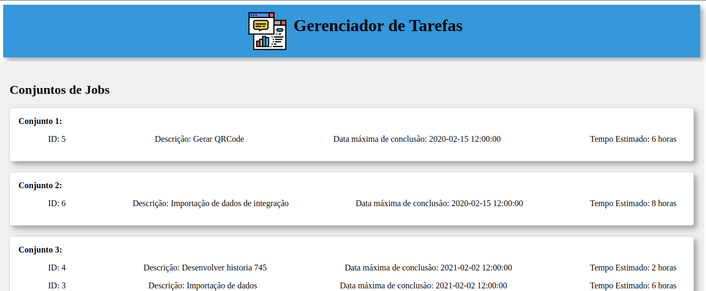

# Gerenciador de Tarefas

O Gerenciador de Tarefas é uma aplicação web/SPA (Single Page Application) que permite aos usuários importar uma lista de tarefas e agrupá-las em conjuntos com base em critérios específicos, como a duração estimada de execução e a data máxima de conclusão. Esta aplicação é construída com Vue.js e oferece uma interface simples para análise e organização de tarefas.

## Funcionalidades

- Importação de tarefas a partir de um arquivo JSON.
- Agrupamento automático de tarefas em conjuntos.
- Exibição das tarefas organizadas por conjuntos na interface.
- Personalização da aparência com estilos baseados em Material Design.

## Como Usar

1. Clone este repositório para o seu ambiente de desenvolvimento:

2. Navegue até o diretório do projeto:

3. Instale as dependências:

4. Execute o projeto localmente:

5. Abra o aplicativo no seu navegador em `http://localhost:8080`.

6. Importe um arquivo JSON com a lista de tarefas e veja como o Gerenciador de Tarefas organiza as tarefas em conjuntos.

## Estrutura do Projeto

- `src/` - Contém os arquivos fonte do projeto.
- `components/` - Componentes Vue.js, incluindo o `JobsAgrupador.vue`.
- `assets/` - Recursos estáticos, como imagens e estilos.
- `App.vue` - Componente principal da aplicação.
- `main.js` - Arquivo de entrada JavaScript.
- `public/` - Recursos públicos acessíveis diretamente pelo navegador.
- `README.md` - Este arquivo de documentação.

## Personalização

Você pode personalizar a aparência do aplicativo alterando os estilos no arquivo `JobsAgrupador.vue` ou incluindo sua própria biblioteca de design, como Material Design ou Bootstrap.

## Contribuição

Contribuições são bem-vindas! Se você deseja contribuir com melhorias, correções de bugs ou novos recursos para o Gerenciador de Tarefas, sinta-se à vontade para abrir uma [issue](https://github.com/seu-usuario/gerenciador-de-tarefas/issues) ou enviar um [pull request](https://github.com/seu-usuario/gerenciador-de-tarefas/pulls).

## Licença

Este projeto está licenciado sob a Licença MIT - consulte o arquivo [LICENSE](LICENSE) para obter detalhes.

---
Desenvolvido por [lucas oliveira](https://github.com/lucasoliver-dev)
